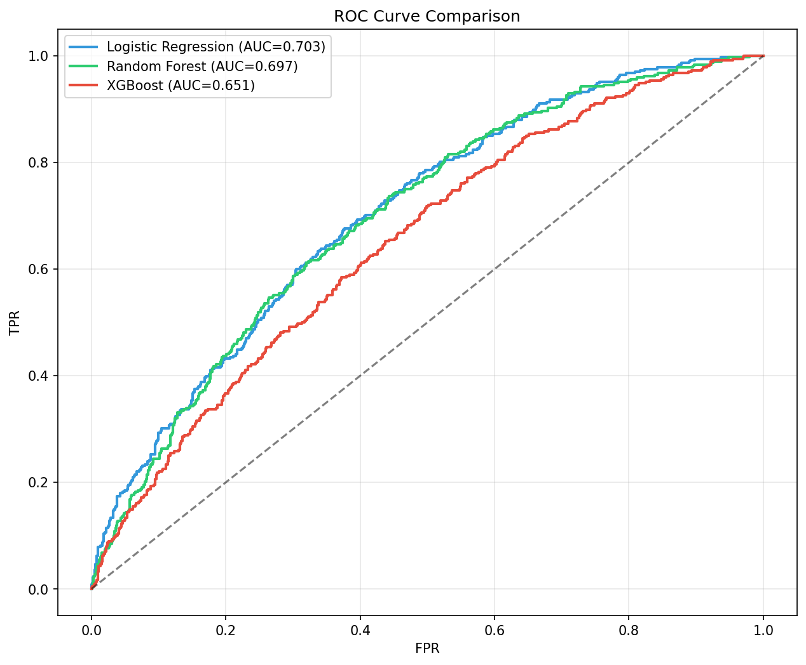
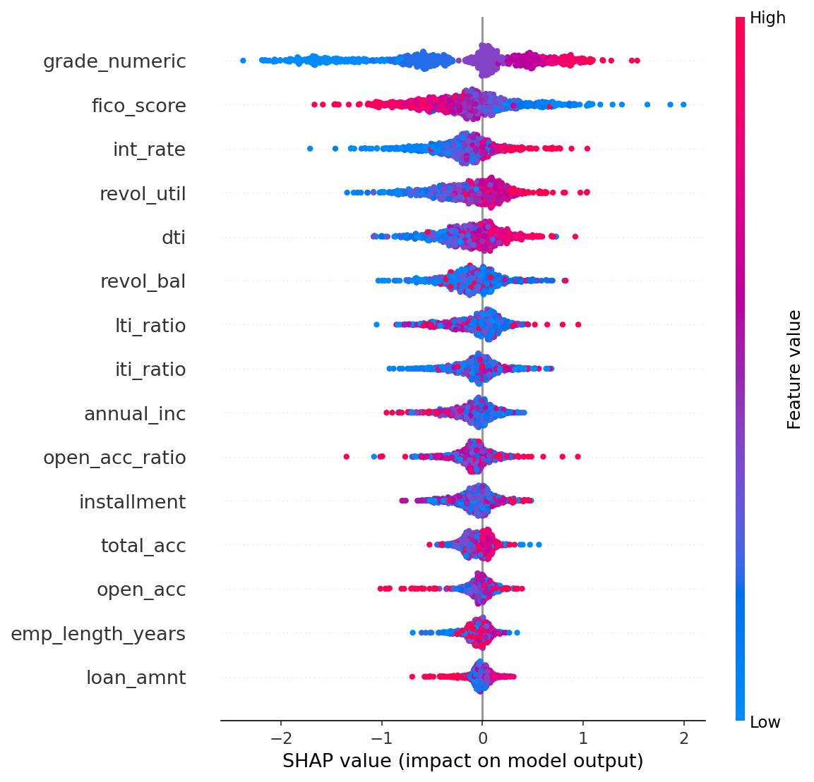
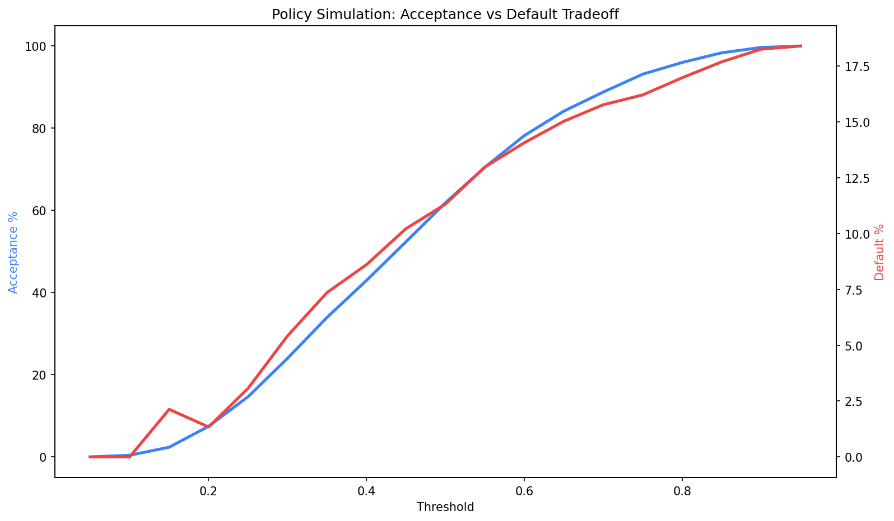
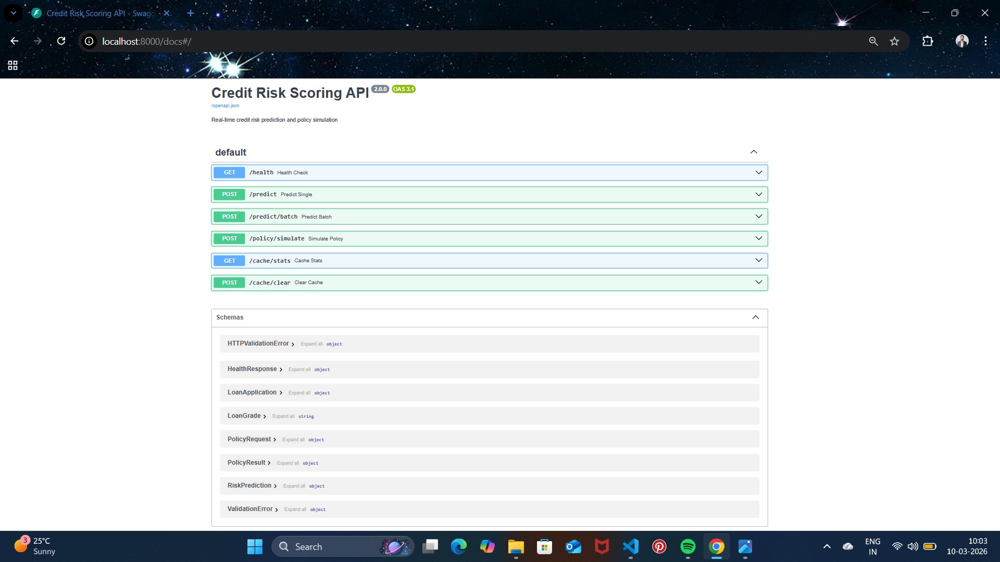
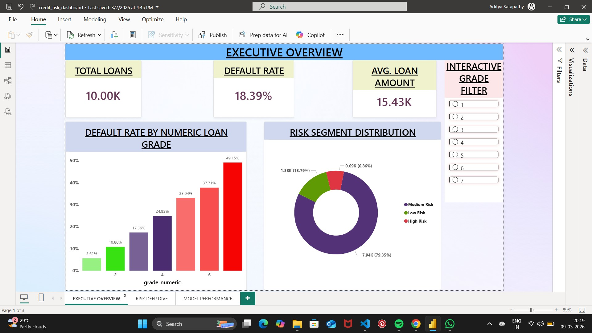
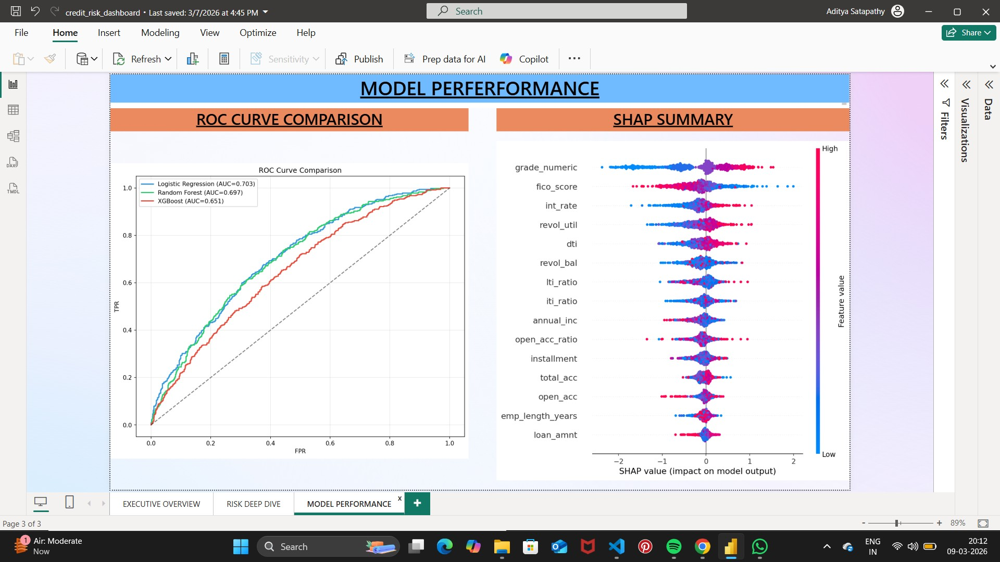

# Credit Risk Scoring Pipeline

End-to-end credit risk prediction system — from raw Lending Club data to a deployed FastAPI scoring API on Azure Cloud.


---

## Architecture

```
┌─────────────┐    ┌──────────────┐    ┌───────────────┐    ┌──────────────┐
│  Raw Data    │───▶│ Data Cleaning│───▶│   Feature     │───▶│   Model      │
│ Lending Club │    │ Dedup, FICO, │    │ Engineering   │    │  Training    │
│  10K loans   │    │  Outliers    │    │ 14 features   │    │ 3 models     │
└─────────────┘    └──────────────┘    └───────────────┘    └──────┬───────┘
                                                                   │
                   ┌──────────────┐    ┌───────────────┐           │
                   │   FastAPI    │◀───│    Policy     │◀──────────┘
                   │ Scoring API  │    │  Simulator    │
                   │  /predict    │    │ Binary Search │
                   └──────┬───────┘    └───────────────┘
                          │
              ┌───────────┴────────────┐
              │   Azure Cloud Deploy   │
              │ PostgreSQL + Blob Store│
              └────────────────────────┘
```

---

## Model Performance

| Model | Accuracy | F1 Score | AUC-ROC |
|-------|----------|----------|---------|
| **Logistic Regression** | 0.663 | 0.403 | **0.704** ✓ Best |
| Random Forest | 0.800 | 0.236 | 0.698 |
| XGBoost | 0.758 | 0.288 | 0.651 |

Best model selected by AUC-ROC. SMOTE applied for class imbalance. SHAP used for feature explainability.

<p align="center">
  
  
</p>

---

## Policy Optimization

Binary search finds the optimal approval threshold balancing acceptance rate vs. default rate:

| Metric | Value |
|--------|-------|
| Optimal Threshold | 0.4453 |
| Acceptance Rate | 51.45% |
| Default Rate | 9.91% |
| Binary Search | 1.17 ms |
| Linear Search | 2.40 ms |
| **Speedup** | **2.1x faster** |

<p align="center">
  
</p>

---

## Tech Stack

| Layer | Technology |
|-------|-----------|
| **ML** | scikit-learn, XGBoost, SHAP, SMOTE (imbalanced-learn) |
| **DSA** | LRU Cache, Binary Search, Min-Heap, Sliding Window, Prefix Sums, Hash Map |
| **API** | FastAPI, Uvicorn, Pydantic validation |
| **Database** | PostgreSQL on Azure, SQLAlchemy ORM |
| **Cloud** | Azure Blob Storage, Azure PostgreSQL, Azure Identity |
| **Data** | Pandas, NumPy, Statsmodels |
| **DevOps** | Docker, GitHub Actions CI/CD, Git |
| **Testing** | pytest (41 test cases) |
| **Visualization** | Matplotlib, Seaborn, Power BI, Chart.js |

---

## Project Structure

```
credit-risk-final/
├── run_pipeline.py              # One-click: clean → engineer → train → simulate → test
├── requirements.txt
├── Dockerfile
├── .github/workflows/ci.yml    # CI: lint + test on every push
│
├── src/
│   ├── data_cleaning.py         # Dedup, FICO calc, outlier capping, validation
│   ├── feature_engineering.py   # 14 engineered features + one-hot encoding
│   ├── model_training.py        # LogReg, RF, XGBoost + SHAP explainability
│   ├── policy_simulator.py      # Binary search threshold optimization
│   ├── api/
│   │   ├── scoring_api.py       # FastAPI endpoints: /predict, /batch, /policy
│   │   └── schemas.py           # Pydantic request/response models
│   └── utils/
│       ├── algorithms.py        # Binary search, sliding window, benchmarks
│       └── data_structures.py   # LRU Cache, SortedRiskArray, RiskBucketMap
│
├── sql/
│   ├── 01_create_schema.sql     # PostgreSQL schema
│   ├── 02_create_tables.sql     # Table definitions
│   ├── 03_etl_pipeline.sql      # SQL-based ETL
│   └── 04_feature_engineering.sql
│
├── tests/
│   ├── test_algorithms.py       # Binary search, sliding window tests
│   ├── test_api.py              # API schema validation tests
│   └── test_data_structures.py  # LRU cache, sorted array, bucket map tests
│
├── data/
│   ├── raw/lending_club_sample.csv
│   └── processed/               # Generated CSVs
│
├── models/                      # Trained .pkl + metrics JSON
├── reports/figures/             # ROC curves, SHAP plots, policy charts
├── dashboards/                  # Interactive HTML dashboard
├── screenshots/                 # Power BI + Swagger UI + Azure Cloud Deployment screenshots
└── benchmarks/                  # Performance benchmarking suite
```

---

## Quick Start

### 1. Clone & Setup

```bash
git clone https://github.com/gitadi2/credit-risk-final.git
cd credit-risk-final
python -m venv venv
venv\Scripts\activate        # Windows
# source venv/bin/activate   # macOS/Linux
pip install -r requirements.txt
```

### 2. Configure Environment

```bash
cp config/.env.example .env
# Edit .env with your database credentials
```

### 3. Run Full Pipeline

```bash
python run_pipeline.py
```

This runs all 5 stages:
1. **Generate** sample data (10K loans)
2. **Clean** — dedup, FICO scores, outlier capping
3. **Engineer** — 14 features + encoding (25 final features)
4. **Train** — 3 models, SHAP analysis, best model selection
5. **Simulate** — Policy optimization + benchmarks

### 4. Launch Scoring API

```bash
uvicorn src.api.scoring_api:app --port 8000
```

Open Swagger UI: [http://localhost:8000/docs](http://localhost:8000/docs)

### 5. Run Tests

```bash
pytest tests/ -v
```

---

## API Endpoints

| Endpoint | Method | Description |
|----------|--------|-------------|
| `/health` | GET | Model status, cache stats, version |
| `/predict` | POST | Score a single loan application |
| `/predict/batch` | POST | Score up to 1,000 applications |
| `/policy/simulate` | POST | Simulate approval policy |

**Example Request:**

```bash
curl -X POST http://localhost:8000/predict \
  -H "Content-Type: application/json" \
  -d '{
    "loan_amnt": 15000,
    "annual_inc": 65000,
    "dti": 18.5,
    "int_rate": 0.12,
    "installment": 450,
    "grade": "B",
    "fico_score": 710
  }'
```

**Example Response:**

```json
{
  "applicant_id": "a1b2c3d4",
  "default_probability": 0.15,
  "risk_segment": "Low Risk",
  "recommendation": "APPROVE",
  "confidence": 0.70,
  "top_risk_factors": ["moderate_dti"],
  "cached": false
}
```

---

## Algorithms & Data Structures

| Component | Complexity | Purpose |
|-----------|-----------|---------|
| **Binary Search Threshold** | O(log(1/ε) × log n) | Optimal approval cutoff |
| **LRU Cache** | O(1) get/put | Cache repeated applicant scores |
| **SortedRiskArray** | O(log n) query | Fast percentile & threshold lookups |
| **RiskBucketMap** | O(1) lookup | Default rate by risk segment |
| **Sliding Window** | O(n) single pass | Rolling default rate monitoring |
| **Prefix Sums** | O(1) range query | Count defaults in score ranges |

---

## Screenshots

<p align="center">
  
</p>

<p align="center">
  
  
</p>

---

## Docker

```bash
docker build -t credit-risk-api .
docker run -p 8000:8000 credit-risk-api
```

---

## Author

ADITYA SATAPATHY
[https://www.linkedin.com/in/adisatapathy]
